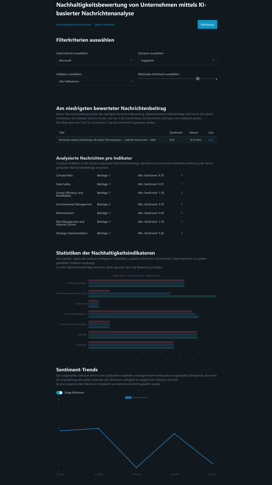
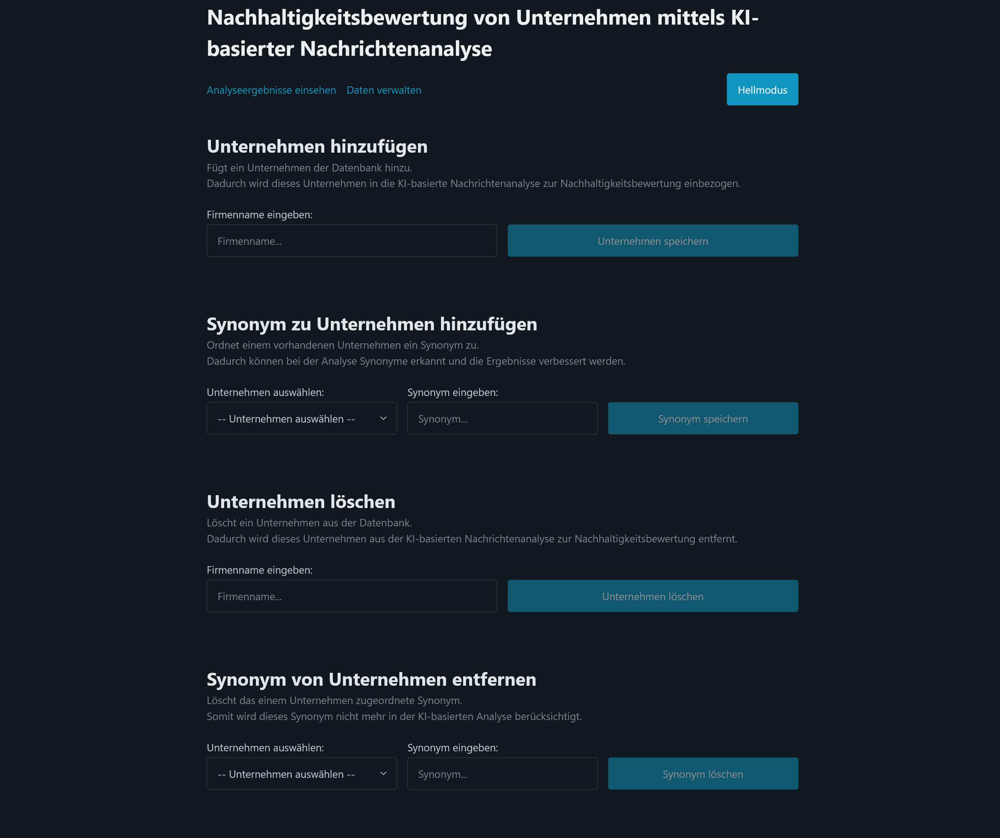

# Company sustainability evaluation using AI-based news analysis

by Ayko Schwedler as part of the bachelor thesis.

## Technologies used

- Technologies: Svelte + TS + Vite
- Template: npm create vite@latest bachelorarbeit-frontend -- --template [svelte-ts](https://vite.new/svelte-ts)

## How to start it

1. Install node.js.
2. Install all dependencies from the package.json with `npm install`.
3. Start server with `npm run dev`.
4. Standard URL for access is http://localhost:5173 and can also be seen in the console.

## Functionality

The website consists of three pages. A dark mode is also available.

### Manage data

- **Add company**: Adds a company to the database. This will include this company in the AI-based news analysis for sustainability rating.
- **Add Synonym to Company**: Assigns a synonym to an existing company. This allows synonyms to be recognised in the analysis and improves the results.
- **Remove company**: Fully removes the company and everything related to it from the analysis and database.
- **Remove Synonym to Company**: Removes a synonym from the company, so that the synonym is no longer included in news analysis/searches.

### Analysis results

Filter:
- **Company**: The company to view for which to show the results.
- **Time span**: The time span in which the news to analyze should be considered. Selectable are "today", "this week", "this month", "this year", "all time".
- **Indicators**: Either "all indicators", or a single indicator can be chosen.
- **Min. sentiment**: The lower threshold at which news will be considered for analysis.

Categories:
- **Lowest rated news item**: This news item has the lowest sentiment rating. The scale goes from 0 to 10, so 5 can be interpreted as average.
- **Analysed news items per indicator**: For each indicator, the number of analysed news articles, the minimum and a detailed list of the news articles used for this indicator can be viewed.
- **Statistics of the sustainability indicators**: In addition to the other available statistics, the minimum, average and maximum of each selected indicator are displayed here.
- **Sentiment Trends**: The selected period is divided into ten points in time and starts at the beginning of the selected period. The period shifts to the start of the first item within that period.

## Screenshots

<figure>
    
    <figcaption align = "center">
        <b>Manage data</b>
    </figcaption>
</figure>

<figure>
    
    <figcaption align = "center">
        <b>View analysis results</b>
    </figcaption>
</figure>

### Possible improvements to be made

- Instead of only providing results for either one or all indicators, let the user choose various indicators per request.
- Also let the user choose multiple companies for sake of comparison.
- Add multiple languages support.
- Let the user select various news agencies to select from, instead of always using Google News.
- Further analysis on the data.

### Notes

- A large part of this code is in German, as the Bachelor thesis itself is written in German.
